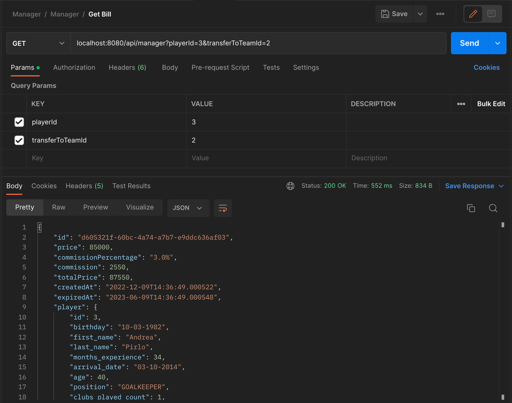
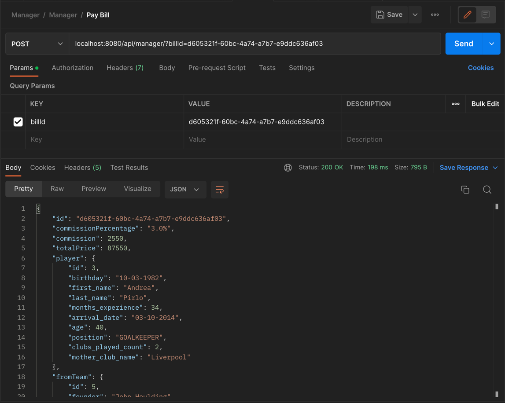
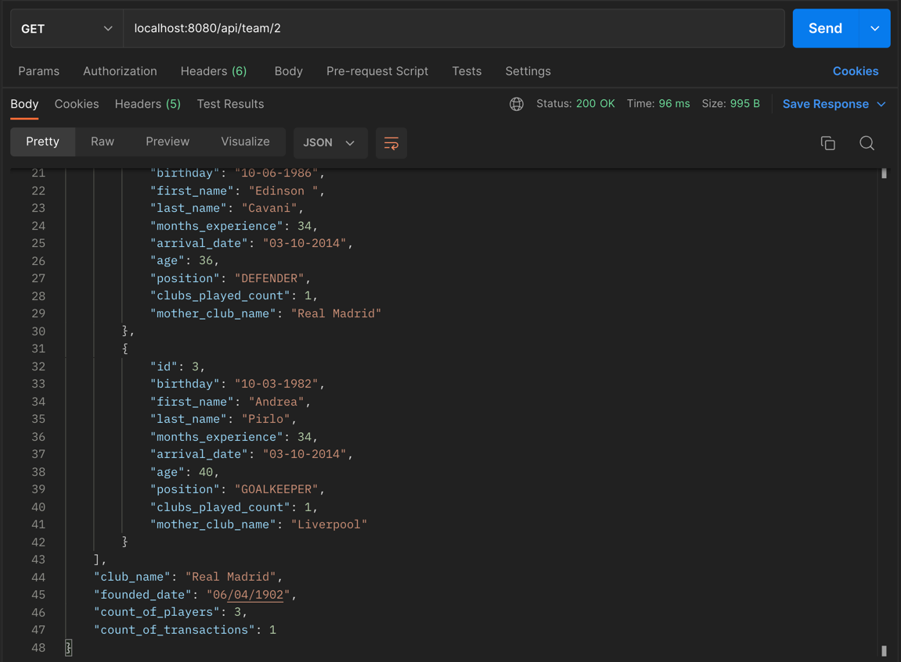

# Football manager ⚽️ [REST API]

Application to operate with CRUD operations of players and teams.

### Required to install

- Java 17
- PostgreSQL

### How to run

Before we start, you need to open PSQL Terminal and create a DB,
You can achieve it with this command

```
CREATE DATABASE manager;
```

The server runs on 8080 port (By default), but if you have any conflicts, you can change it here too.
Username and password for the DB you can configure while creating database.

```
#application.properties
server.port = 8080

jdbc.driverClassName=org.postgresql.Driver
jdbc.url=jdbc:postgresql://localhost:5432/manager
jdbc.username=postgres
jdbc.password=421970
hibernate.dialect=org.hibernate.dialect.PostgreSQLDialect
hibernate.show_sql=false
hibernate.format_sql=true
hibernate.hbm2ddl.auto=create
```
### Run it 🚀

That's all, you need to run Application class in your IDE.

```java
@SpringBootApplication
public class ManagerApplication {
    //...
}
```

### Database

The project is already include all pre-data you need to test the application,
so you could avoid creating players and teams to work with. 

`import.sql` includes the data you need to test it

### How to transfer player
Firstly, you need to make a bill. (I'll transfer player with id '3' to the team id with '2')

To make bill make a request to: `localhost:8080/api/manager?playerId=3&transferToTeamId=2`



Then we need to make a payment in order to do it you need to copy id of the bill and insert it into request param 'billId'.
`"id": "d605321f-60bc-4a74-a7b7-e9ddc636af03",`



Payment is accepted, player and money are transferred. To make sure you can make request to `localhost:8080/api/team/2` and find the user with id '3'



### Postman

The collection of requests: [Link](https://api.postman.com/collections/18627038-4c49ef96-63cf-482b-b5ce-86d058e15f53?access_key=PMAT-01GKVD8H796P5PG5HC4ZPTPK0B) (api.postman.com)

`https://api.postman.com/collections/18627038-4c49ef96-63cf-482b-b5ce-86d058e15f53?access_key=PMAT-01GKVD8H796P5PG5HC4ZPTPK0B`
